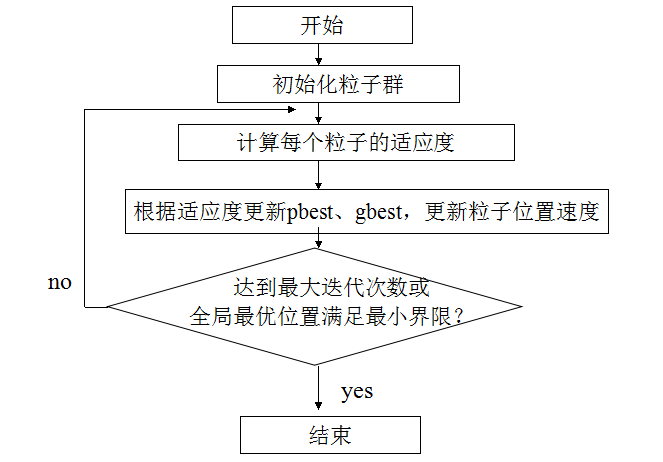

# 粒子群优化算法
粒子群算法的思想源于对鸟/鱼群捕食行为的研究，模拟鸟集群飞行觅食的行为，鸟之间通过集体的协作使群体达到最优目的，是一种基于Swarm Intelligence的优化方法。它通过追随当前搜索到的最优值来寻找全局最优。粒子群算法与其他现代优化方法相比的一个明显特色就是所需要调整的参数很少、简单易行，收敛速度快，已成为现代优化方法领域研究的热点。

## 1. 基本思想
设想这样一个场景：一群鸟在随机搜索食物。已知在这块区域里只有一块食物；所有的鸟都不知道食物在哪里；但它们能感受到当前的位置离食物还有多远。那么找到食物的最优策略是什么呢？

    (1) 搜寻目前离食物最近的鸟的周围区域

    (2) 根据自己飞行的经验判断食物的所在。

PSO正是从这种模型中得到了启发，PSO的基础是信息的社会共享。

## 2. 问题抽象
鸟被抽象为没有质量和体积的微粒(点)，并延伸到$D$维空间，粒子$i$在$D$维空间的位置表示为矢量:
$$X_i＝(x_1，x_2，…，x_D), X_i\in[X_{min,d},X_{max,d}]$$
飞行速度表示为矢量:
$$V_i＝(v_1，v_2，…，v_D),V_i\in[V_{min,d},V_{max,d}]$$
每个粒子都有一个由目标函数决定的适应值$(fitness value, 即f(X_i))$、
并且知道自己到目前为止发现的最好位置$(pbest)$
$$pbest_i=(p_{i1},p_{i2},...,p_{iD})$$
和现在的位置$X_i$。这个可以看作是粒子自己的飞行经验．除此之外，每个粒子还知道到目前为止整个群体中所有粒子发现的最好位置$(gbest)$($gbest$是$pbest$中的最好值):
$$gbest=(g_1,g_2,...,g_D)$$
这个可以看作是粒子同伴的经验。粒子就是通过自己的经验和同伴中最好的经验来决定下一步的运动。  

## 3. 算法描述
PSO初始化为一群随机粒子(随机解),然后通过迭代找到最优解。在每一次的迭代中，粒子通过跟踪两个“极值”($pbest,gbest$)来更新自己。在第$k$次迭代中，找到这两个最优值后，粒子$i$的速度更新公式为:
$$V_{id}^k=wV_{id}^{k-1}+c_1r_1(pbest_{id}-X_{id}^{k-1})+c_2r_2(gbest_i-X_{id}^{k-1})$$
粒子$i$的位置更新公式为:
$$X_{id}^k=X_{id}^{k-1}+V_{id}^{k-1}$$
其中:  
$V_{id}^k$——第$k$次迭代粒子$i$飞行速度矢量的第$d$维分量  
$X_{id}^k$——第$k$次迭代粒子$i$位置矢量的第$d$维分量  
$w$——惯性因子，调节对解空间的搜索范围  
$C_1,C_2$——学习因子，调节学习步长  
$r_1,r_2$——两个随机数，增加搜索随机性  
    
    粒子速度更新公式包含三部分： 第一部分为“惯性部分”，即对粒子先前速度的记忆；第二部分为“自我认知”部分，可理解为粒子当前位置与自己最好位置之间的距离；第三部分为“社会经验”部分，表示粒子间的信息共享与合作，可理解为粒子当前位置与群体最好位置之间的距离。

## 4. 粒子群算法流程
标准PSO算法的流程：
1. 初始化一群微粒(群体规模为$M$)，包括随机位置和速度；

2. 评价每个微粒的适应度；

3. 对每个微粒，将其适应值与其经过的最好位置$pbest$作比较，如果较好，则将其作为当前的最好位置$pbest$;
4. 对每个微粒，将其适应值与其经过的最好位置$gbest$作比较，如果较好，则将其作为当前的最好位置$gbest$;

5. 根据(2)、(3)式调整微粒速度和位置；

6. 未达到结束条件则转Step2。

迭代终止条件根据具体问题一般选为最大迭代次数$K$或微粒群迄今为止搜索到的最优位置满足预定最小适应阈值。

## 参数选择与优化
参数$w,c_1,c_2$的选择分别关系粒子速度的3个部分：惯性部分、社会部分和自身部分在搜索中的作用。如何选择、优化和调整参数，使得算法既能避免早熟又能比较快的收敛，对工程实践有着重要意义。

* 惯性权重$w$描述粒子上一代速度对当前代速度的影响。$w$值较大，全局寻优能力强，局部寻优能力弱；反之，则局部寻优能力强。当问题空间较大时，为了在搜索速度和搜索精度之间达到平衡，通常做法是使算法在前期有较高的全局搜索能力以得到合适的种子，而在后期有较高的局部搜索能力以提高收敛精度。所以$w$不宜为一个固定的常数。
$$w=w_{max}-(w_{max}-w_{min})*\frac{run}{run_{max}}$$
>其中，$w_{max}$最大惯性权重，$w_{min}$最小惯性权重，$run$当前迭代次数，$run_{max}$为算法迭代总次数。较大的$w$有较好的全局收敛能力，较小的$w$则有较强的局部收敛能力。因此，随着迭代次数的增加，惯性权重$w$应不断减少，从而使得粒子群算法在初期具有较强的全局收敛能力，而晚期具有较强的局部收敛能力。

* 学习因子$c2=0$称为自我认识型粒子群算法，即“只有自我，没有社会”，完全没有信息的社会共享，导致算法收敛速度缓慢；学习因子$c1=0$称为无私型粒子群算法，即“只有社会，没有自我”，会迅速丧失群体多样性，容易陷入局部最优解而无法跳出；$c1,c2$都不为0，称为完全型粒子群算法，完全型粒子群算法更容易保持收敛速度和搜索效果的均衡，是较好的选择。

* 群体大小$M$是一个整数，$M$很小时陷入局部最优解的可能性很大；$M$很大时PSO的优化能力很好，但是当群体数目增长至一定水平时，再增长将不再有显著作用，而且数目越大计算量也越大。群体规模m 一般取20～40，对较难或特定类别的问题 可以取到100～200。

* 粒子群的最大速度$V_{max}$对维护算法的探索能力与开发能力的平衡很重要，$V_{max}$较大时，探索能力强，但粒子容易飞过最优解；$V_{max}$较小时，开发能力强，但是容易陷入局部最优解。$V_{max}$一般设为每维变量变化范围的10%-20%。

